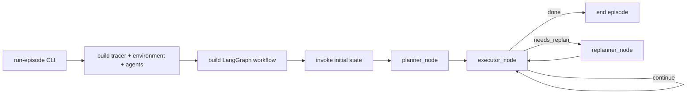
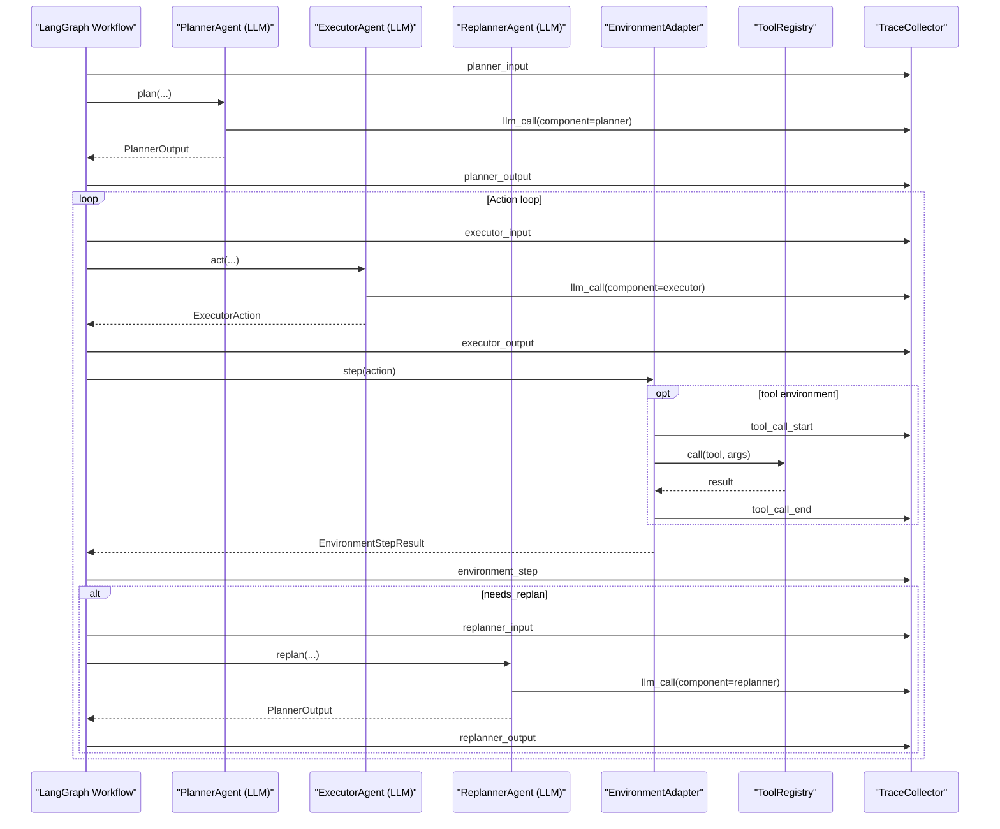
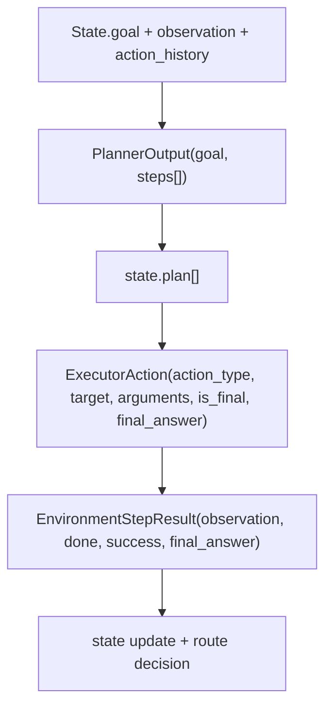

# Orchestration Pseudocode: Planner, Executor, Replanner

This document explains how the current code orchestrates sub-agents/modules/models, with pseudocode and visual diagrams.

Related docs:
- Visual architecture: [`AGENT_ARCHITECTURE_VISUAL_GUIDE.md`](AGENT_ARCHITECTURE_VISUAL_GUIDE.md)
- Framework rationale: [`AGENT_FRAMEWORK_ARCHITECTURE.md`](AGENT_FRAMEWORK_ARCHITECTURE.md)
- Planning deep dive: [`PLANNING_ORCHESTRATION_DEEP_DIVE.md`](PLANNING_ORCHESTRATION_DEEP_DIVE.md)
- Trace plan for training: [`../plans/TRAINING_DATA_TRACING_PLAN.md`](../plans/TRAINING_DATA_TRACING_PLAN.md)

## 1) Real modules in current code

Primary orchestration and runtime:
- Workflow graph: [`../../src/plan_and_act/graph/workflow.py`](../../src/plan_and_act/graph/workflow.py)
- Transition policy: [`../../src/plan_and_act/graph/transitions.py`](../../src/plan_and_act/graph/transitions.py)
- CLI runtime entry: [`../../src/plan_and_act/eval/runner.py`](../../src/plan_and_act/eval/runner.py)

Sub-agents:
- Planner: [`../../src/plan_and_act/agents/planner.py`](../../src/plan_and_act/agents/planner.py)
- Executor: [`../../src/plan_and_act/agents/executor.py`](../../src/plan_and_act/agents/executor.py)
- Replanner: [`../../src/plan_and_act/agents/replanner.py`](../../src/plan_and_act/agents/replanner.py)

Environment + tools:
- Environment factory: [`../../src/plan_and_act/environments/factory.py`](../../src/plan_and_act/environments/factory.py)
- Tool environment: [`../../src/plan_and_act/environments/tooling.py`](../../src/plan_and_act/environments/tooling.py)
- Tool registry: [`../../src/plan_and_act/tools/factory.py`](../../src/plan_and_act/tools/factory.py)

Tracing:
- Collector and schemas: [`../../src/plan_and_act/tracing/collector.py`](../../src/plan_and_act/tracing/collector.py), [`../../src/plan_and_act/tracing/schemas.py`](../../src/plan_and_act/tracing/schemas.py)
- LLM tracing hooks: [`../../src/plan_and_act/utils/llm.py`](../../src/plan_and_act/utils/llm.py)

## 2) High-level coordination flow



## 3) Pseudocode of full episode orchestration

```text
function run_episode(goal, configs):
    load runtime/model/trace configs
    tracer = TraceCollector(run_id)
    env = build_environment(kind, tracer)

    prompts = PromptTemplates(...)
    planner = PlannerAgent(model_cfg.planner, prompts, tracer)
    executor = ExecutorAgent(model_cfg.executor, prompts, tracer)
    replanner = ReplannerAgent(model_cfg.replanner, prompts, tracer)

    tracer.start_session(goal, environment, model_stack, runtime_config)
    workflow = build_workflow(planner, executor, replanner, env, tracer)

    state = build_initial_state(goal, max_steps, dynamic_replanning, use_cot, env.reset(goal))
    final_state = workflow.invoke(state)

    tracer.log_event("episode_end", summary_from(final_state))
    tracer.close(status="completed", summary=...)
    write_artifact(final_state)
    return final_state
```

## 4) Pseudocode per node (exact logic shape)

### 4.1 Planner node

```text
function planner_node(state):
    trace planner_input(goal, observation, action_history)
    plan_output = planner.plan(goal, observation, action_history, use_cot, step_count)
    trace planner_output(steps)
    return {
        plan = plan_output.steps,
        current_step_idx = 0,
        needs_replan = false
    }
```

### 4.2 Executor node

```text
function executor_node(state):
    if state.done: return {}
    if step_count >= max_steps: stop_episode(reason=max_steps)

    if plan empty or current_step_idx out of range:
        if dynamic_replanning disabled: stop_episode(reason=plan_exhausted)
        else: return { needs_replan = true }

    current_step = validate_plan_step(state.plan[current_step_idx])
    trace executor_input(current_step, observation)

    action = executor.act(goal, current_step, observation, step_index, total_steps, use_cot, step_count)
    trace executor_output(action)

    env_result = environment.step(action, new_step_count)
    trace environment_step(env_result)

    done = action.is_final or env_result.done
    success = action.is_final or env_result.success
    needs_replan = dynamic_replanning and not done

    return updated_state(...)
```

### 4.3 Replanner node

```text
function replanner_node(state):
    trace replanner_input(previous_plan, action_history, observation)
    replanned = replanner.replan(goal, previous_plan, action_history, observation, use_cot, step_count)
    trace replanner_output(steps)
    return {
        plan = replanned.steps,
        current_step_idx = 0,
        needs_replan = false
    }
```

## 5) Sequence between modules and models



## 6) Model orchestration policy (important)

Current policy:
1. One model call for planner per planning round.
2. One model call for executor per step.
3. One model call for replanner when `needs_replan=true`.
4. Stop/replan routing is deterministic code policy, not LLM-controlled policy.

Implication:
1. This is robust for debugging and reproducibility.
2. It is easier to trace and convert into role-specific training data.
3. It is not a free-form autonomous loop where the model decides orchestration graph.

## 7) Data objects exchanged at boundaries



Schema files:
- Agent I/O models: [`../../src/plan_and_act/core/schemas.py`](../../src/plan_and_act/core/schemas.py)
- State shape: [`../../src/plan_and_act/core/state.py`](../../src/plan_and_act/core/state.py)

## 8) Tracing points used for training-data extraction

Events that matter most:
1. `planner_input`, `planner_output`
2. `executor_input`, `executor_output`
3. `replanner_input`, `replanner_output`
4. `llm_call` (prompt/raw/parsed/latency/tokens)
5. `tool_call_start`, `tool_call_end`
6. `environment_step`, `episode_end`, `episode_error`

These are the direct backbone for future exporters:
- planner SFT
- executor SFT
- replanner SFT

## 9) Practical notes for extending orchestration

If you add a new sub-agent/module:
1. Define schema at boundary first.
2. Add node + transition path in workflow graph.
3. Add trace events at input/output boundaries.
4. Add tests for routing and stop conditions.
5. Update this file with the new graph branch.

